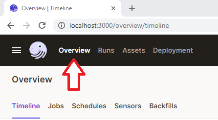
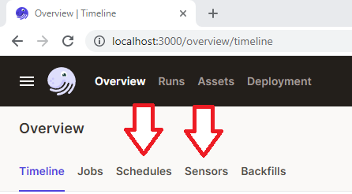
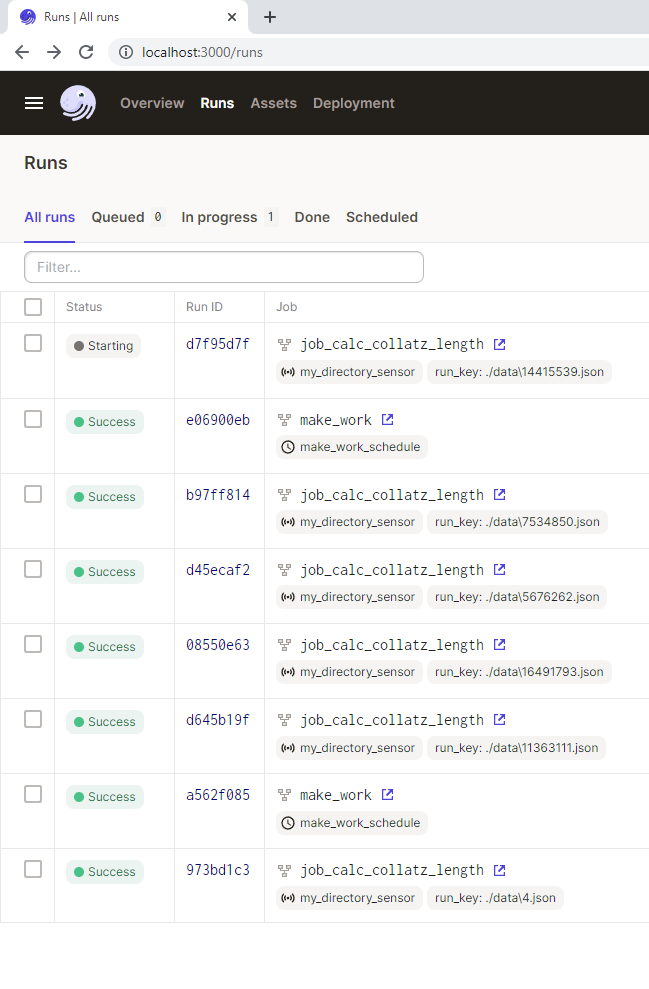

# sensor_experiment

This project was a testbed to explore:
1. sensors
2. scheduled work
3. jobs and ops
4. dagit's ui around the above
5. if/how dagster handled processing *only new work*

# Getting started
I ran `pip install` on dagster and dagit (v 1.1.14) and that's all I needed.  I removed the rest of the "dagster project scaffold" files, but left setup in case it's useful to anyone.

After dagster is installed, `cd` to this directory and start the Dagit web server along with the daemon by entering `dagster dev -w workspace.yaml`

Open http://localhost:3000 with your browser to see the project.  Once your Dagster Daemon is running, you can start turning on schedules and sensors for your jobs.

# Turning on schedules and sensors
Click Overview, then select schedules and sensors.  In each section, you'll find a button like a slide switch.  Click it to enable that sensor/scheduled job.

Clicking on the name of the sensor/schedule will show you its history.

# Runs
Next to overview, click "Runs" to see all the work being done.  You'll notice that each sensor tick only results in the newest files being processed.  That's because it recognizes that it's already processed the older run_key values.

Click on a "Run ID" for details.  

# Data
The ./data folder will slowly blow up.  Clean it up at your discretion.
